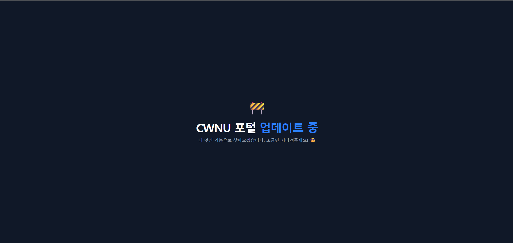
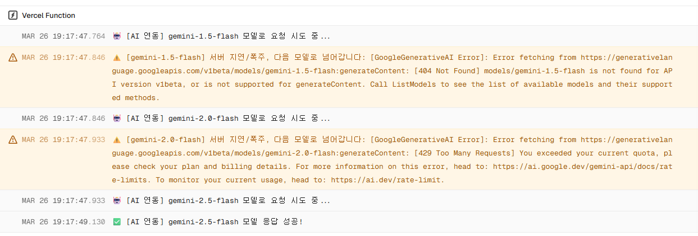
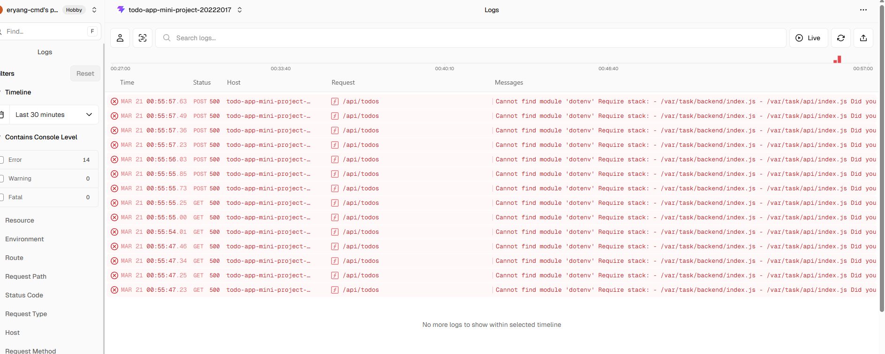
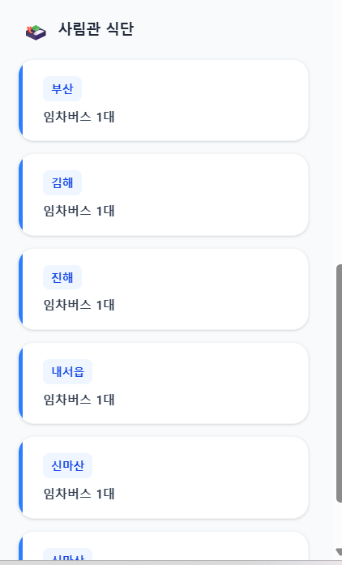
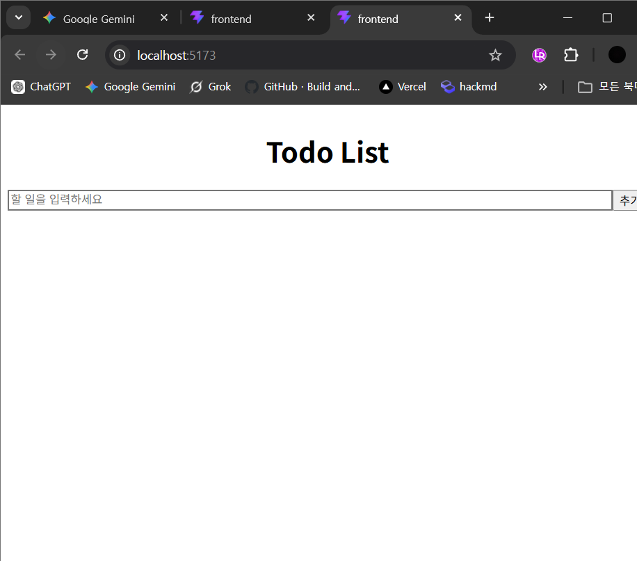
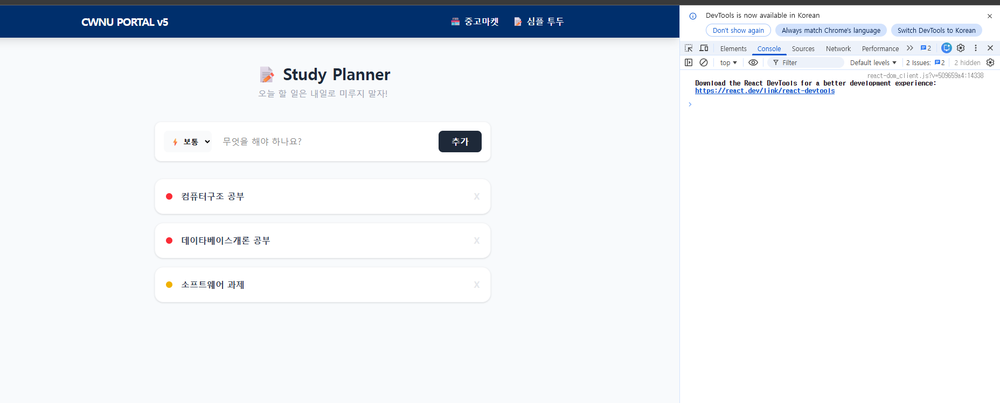
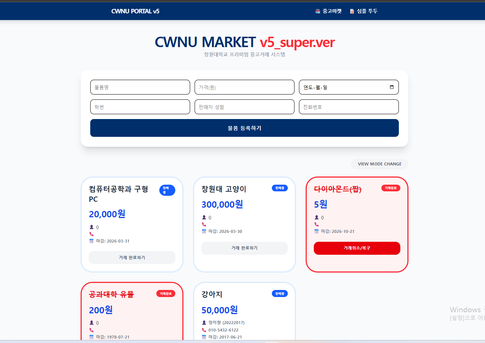
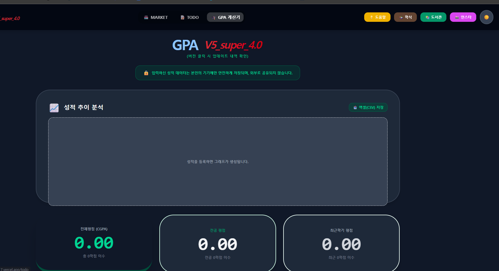
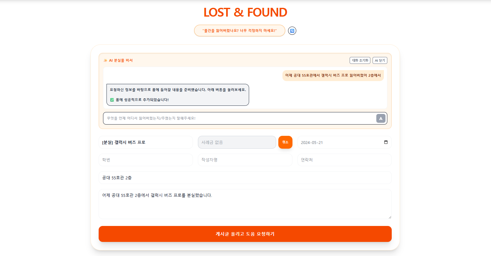
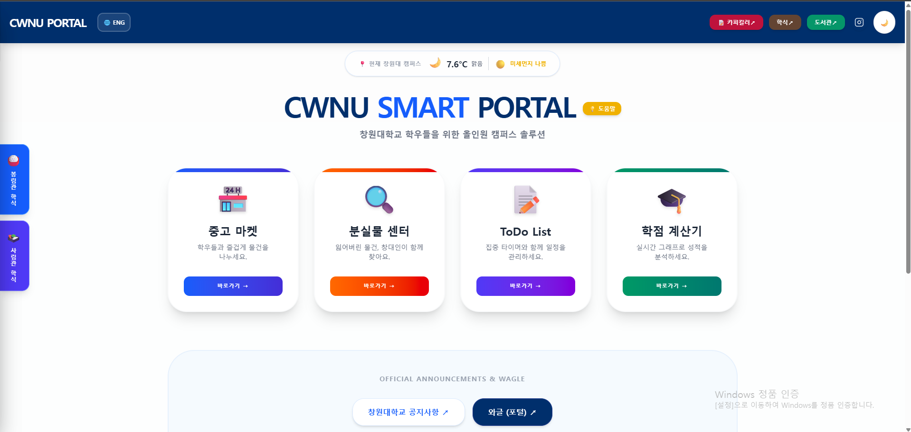

# 소프트웨어 공학 과제: CWNU 스마트 포털 통합 시스템 

- [Github 원격 저장소 바로가기](https://github.com/eryang11188/todo-app-mini-project-20222017.git)
- [Vercel 배포 사이트 바로가기](https://todo-app-mini-project-20222017.vercel.app/)

## 기획
- _웹프로그래밍_(25-1학기) 기말 과제 `todos_v4`의 한계를 극복하고, 나아가 창원대학교 학우들의 편의성을 위해 개발된 **실시간 클라우드 DB 연동 및 CWNU 스마트 포털 구축 프로젝트**

  - 창원대학교 재학 중 내가 경험한 파편화된 학사 정보 및 기존 포털 시스템의 불편함을 파악하고 이를 해결하고자 기획했다. 

  - 학생들이 실질적으로 가장 자주 사용하는 핵심 기능(중고장터, 분실물, 식단, ToDo 등)과 교내 주요 링크를 단일 인터페이스에 통합하여 접근성을 극대화.

  - 자동 폼 완성 기능과 간단한 질의가 가능한 **AI 비서** 탑재.

  - 글로벌 캠퍼스 환경에 발맞춰 재학 중인 외국인 유학생들을 위해 영어 지원 체계를 도입하여 사용자 편의성을 크게 증대.

---

## 미리보기 - CWNU 스마트 포털

### 메인 페이지
|  |
|:--:|
| **▲ 메인페이지** |

### 중고마켓 / 분실물센터
|  | 
|:--:|:--:|
| **▲ 중고마켓** | **▲ 분실물센터** |

### ToDo 리스트 / 학점계산기
|  | 
|:--:|:--:|
| **▲ ToDo 리스트** | **▲ 학점계산기(예시)** |


---

## 목차

- [I. 서론](#i-서론)
  - [개요](#개요)
  - [1. 프로젝트 목적과 방향성](#1-프로젝트-목적과-방향성)
  - [2. 과제 요구 조건 체크리스트](#2-과제-요구-조건-체크리스트)
  - [3. 주요 파일 및 폴더 구조](#3-주요-파일-및-폴더-구조)
- [II. 본론](#ii-본론)
  - [미리보기 - 주요 기능 및 AI 비서](#미리보기---주요-기능-및-ai-비서)
  - [1. 개발 환경](#1-개발-환경)
  - [2. 시스템 구조](#2-시스템-구조)
  - [3. 소프트웨어공학 프로세스 적용](#3-소프트웨어공학-프로세스-적용)
- [III. 문제 해결](#iii-문제-해결)
  - [1. 문제 요약 테이블](#1-문제-요약-테이블)
  - [5. Issue 기록](#5-issue-기록)
  - [6. Pull Request 기록](#6-pull-request-기록)
- [IV. 결론](#iv-결론)
  - [1. 배운 점](#1-배운-점)
  - [2. 느낀 점](#2-느낀-점)
  - [3. 아쉬운 점 및 향후 계획](#3-아쉬운-점-및-향후-계획)
  - [프로젝트 개발 변천사 부록](#프로젝트-개발-변천사-부록)

---

# I. 서론

## 개요

- **이름:** 정이량
- **학년 / 학번:** 3학년 / 2022 2017
- **과목명:** 소프트웨어 공학
- **교수명:** 이 혁

---

## 1. 프로젝트 목적과 방향성

**본 프로젝트는 **데이터 휘발성**의 한계를 극복하고, 확장된 풀스택 서비스를 구현하기 위해 기획되었다.**

- 사용자가 브라우저를 새로고침해도 데이터가 영구 보존되는 **실시간 클라우드 데이터베이스(MongoDB Atlas) 환경**을 구축하였으며, 단순한 할 일 관리를 넘어 창원대 학생들을 위한 **프리미엄 중고거래 마켓 시스템**과 **분실물 센터 시스템**으로 기능을 대폭 확장함.
  - > **중고거래 시스템과 분실물 시스템은 실험적 성격의 기능임. (추후 세션 기반 로그인 기능 도입 등 확장 예정)**

- 또한 ToDo 목록에서는 직관적인 할 일 관리를 위해 List/Grid/Table 다중 뷰 모드를 지원하며, **집중 타이머 및 스톱워치 기능**을 새롭게 추가했다. 특히 할 일 카드 내에 실시간으로 밀리초 단위까지 줄어드는 시간 출력 렌더링을 구현하여 시각적인 생산성 향상을 적용.
  - > 기존 25년 1학기 웹프로그래밍 기말 과제로 제출했던 로컬 기반의 `todos_v4` 앱이 가진 **데이터 휘발성**의 한계를 극복 [(_25-1학기 웹프로그래밍 과제: todos_v4_)](https://github.com/eryang11188/WebProgramming_team-project.git)

- 새롭게 학점계산기를 추가하여, 추가한 과목들의 학점 데이터나 성적표가 DB에 반영되지 않고 사용자의 로컬 저장소에만 반영되게 적용하였음.

- 나아가 최신 생성형 AI 기술인 **Google Gemini API (Gemini-flash)** 를 결합하여, **대화형 폼 자동완성 비서(AI Assistant)** 를 중고장터, 분실물센터, ToDo 리스트에 전면 도입함으로써 혁신적인 사용자 경험(UX)을 달성. 

- 각각의 모든 페이지는 모바일 및 태블릿 환경에 맞춘 **반응형 웹 디자인**으로 최적화 완료.

- 모든 페이지는 영어를 지원하며, 라이트 모드/다크 모드 테마를 변경할 수 있게 설정.

---

## 2. 과제 요구 조건 체크리스트

| 구분 | 요구 사항 | 구현 내용  | 상태 |
|:---:|---|---|:---:|
| **기본 CRUD** | Todo 항목 추가, 목록 보기, 완료 체크, 삭제 | 제목 입력 기반 CRUD 및 중고거래 완료/삭선 처리 완벽 구현 | **O** |
| **기술 스택** | React+Vite, Express, MongoDB, Vercel | 요구 스택 100% 수용 및 Tailwind CSS 기반 반응형 UI 구축 | **O** |
| **SE 프로세스** | 요구사항 → 구현 → 테스팅 → 배포 과정 이행 | Git 브랜치 전략 기반 형상 관리 및 로컬/배포 교차 검증 수행 | **O** |
| **생성형 AI 활용** | 코드 작성 및 디버깅에 AI 적극 활용 | 단순 코딩 보조를 넘어 **'대화형 AI 폼 자동완성 비서'** 구현 | **O** |
| **배포 및 연동** | MongoDB Atlas 연동 및 Vercel 배포 | 클라우드 DB 연동 및 Serverless 환경 배포 성공 (URL 확보) | **O** |
| **AI 비서** | (추가 항목) AI비서 추가 및 API 장애 대응 | **다중 AI** 로직으로 429 에러 및 서버 장애 방어 | **O** |
| **UI/UX 강화** | (추가 항목) 시각적 편의성 및 기능 확장 | List/Grid/Table 3단 뷰 전환 및 집중 타이머 기능 탑재 | **O** |
| **UI/UX 강화** | (추가 항목) 시각적 편의성 및 기능 확장 | 다크모드 <-> 라이트모드 전환 가능 기능 탑재 | **O** |

---

## 3. 주요 파일 및 폴더 구조

```text
todo-app-mini-project-20222017/ # root/
├── backend/                    # Node.js 서버 및 API 로직
│   ├── index.js                # 백엔드 메인 서버 (AI 릴레이 로직 포함)
│   ├── .env                    # API Key 및 MongoDB URI 환경변수
│   └── package.json            # 백엔드 의존성 및 스크립트 관리
├── frontend/                   # React 프론트엔드 (Vite 기반)
│   ├── src/                    # 프론트엔드 소스 코드
│   │   ├── pages/              # 기능별 주요 페이지 컴포넌트
│   │   │   ├── MainPage.jsx    # 대시보드 (학식, 날씨, 각종 학교 포털)
│   │   │   ├── TodoPage.jsx    # ToDo (타이머, 스톱워치, AI 비서)
│   │   │   ├── MarketPage.jsx  # 중고장터 (게시글 등록, 폼 정렬, AI비서)
│   │   │   ├── LostPage.jsx    # 분실물센터 (게시글 등록, 폼 정렬, AI비서)
│   │   │   └── GpaPage.jsx     # 학점 계산기 
│   │   ├── App.jsx             # 메인 라우팅 및 환경 제어 로직
│   │   └── main.jsx            # React 엔트리 포인트
│   ├── tailwind.config.js      # 디자인 스타일 설정 파일
│   └── vite.config.js          # 빌드 및 경로 최적화 설정
├── screenshots/                # 보고서 및 README 이미지 & 동영상
├── README.md                   # 프로젝트 통합 가이드 및 보고서
└── vercel.json                 # Vercel 배포 및 서버리스 라우팅 설정
```

# II. 본론

## 미리보기 - 주요 기능 및 AI 비서

### 기능 1. 메인 화면 및 반응형 보드

|  | .gif) |
|:---:|:---:|
| **▲ 실시간 날씨 및 미세먼지 정보** | **▲ 모바일 환경 최적화 (반응형 UI)** |
|  |  |
| **▲ 학식 및 알레르기 안내 (사림관)** | **▲ 학식 및 알레르기 안내 (봉림관)** |

> **_모바일 최적화는 메인 페이지뿐만 아니라 전체 탭에서도 동일하게 적용됩니다._**


---

### 기능 2. 중고거래 탭
|  |  |
|:---:|:---:|
| **▲ CRUD 및 완료 처리** | **▲ 정렬 및 검색 기능** |
| _2026-03-28%20035427.gif) | _2026-03-28%20035427.gif) |
| **▲ 중고장터 AI 폼 완성 (한글)** | **▲ 중고장터 AI 폼 완성 (영어)** |

---

### 기능 3. 분실물 센터 탭
|  |  |
|:---:|:---:|
| **▲ CRUD 및 완료 처리** | **▲ 정렬 및 검색 기능** |
| _2026-03-28%20035427.gif) | _2026-03-28%20035427.gif) |
| **▲ 분실물센터 AI 폼 완성 (한글)** | **▲ 분실물센터 AI 폼 완성 (영어)** |

---

### 기능 4. ToDo 리스트 탭
|  |  |
|:---:|:---:|
| **▲ 드래그 앤 드롭 순서 변경** | **▲ 다중 뷰(List/Grid/Table)** |
|  |  |
| **▲ 타이머&스톱워치** | **▲ ToDo AI 비서 (간단 질의)** |


### 기능 5. 학점 계산기 탭

|  |  |  |
|:---:|:---:|:---:|
| **▲ 학점 및 성적 추가 등록** | **▲ 남은 학점 계산 시뮬레이터** | **▲ 성적 데이터 엑셀(.xlsx) 저장** |

> **_입력된 성적 데이터를 바탕으로 졸업까지 필요한 학점을 자동으로 계산하고 파일로 내보낼 수 있음_**

> **_위 테이블의 학점은 모두 예시로 등록된 학점임_**


---


## 1. 개발 환경 

- **버전 관리:** Git, GitHub
- **IDE:** Visual Studio Code


## 2. 시스템 구조
본 시스템은 컴포넌트 기반의 모던 프론트엔드 환경과 RESTful API 기반의 백엔드로 구성된 **풀스택(Full-Stack) 아키텍처**를 따른다.

- **Frontend (React + Vite):** 사용자 UI/UX 렌더링 및 Axios를 통한 서버 비동기 통신 처리. Tailwind CSS를 활용한 완벽한 반응형 웹(Responsive Web) 구현.
- **Backend (Node.js API):** 비즈니스 로직 처리 및 클라이언트 API 연산 수행.
- **Database (MongoDB Atlas):** 클라우드 기반 NoSQL 데이터베이스를 활용하여 브라우저 새로고침에도 휘발되지 않는 데이터 영속성(Persistence) 보장.
- **AI (Google Gemini API):** 대화형 폼 자동완성 처리를 위해 연동. 서버 부하 및 API 한도 초과(429)를 방어하기 위해 **다중 모델 릴레이(Multi-Model Relay)** 아키텍처를 백엔드에 직접 적용.
- **Server (Vercel):**  백엔드 API 배포 및 프론트엔드 정적 호스팅 통합 (CI/CD 파이프라인 구축).

---

## 3. 소프트웨어공학 프로세스 적용 


### 3-1. 요구사항 & 관리
- 단위 기능을 안전하게 개발하고 병합하기 위해 Git Branch 전략을 세분화하여 작업 내역을 격리하고 충돌을 방지했다.
- 각 브랜치별로 로컬에서 안전하게 테스트 후, `main` 브랜치에 병합하여 최종 배포

| 브랜치명 | 용도 및 주요 작업 내용 |
|---|---|
| `main` | 배포용 안정화 최종 브랜치 |
| `feature/todos_v4~5` | 기존 투두 앱 고도화, 스톱워치/타이머 및 밀리초 단위 렌더링 결합 |
| `feature/ai-integration` | Gemini API 연동 및 자연어 파싱 프롬프트 엔지니어링 전용 브랜치 |
| `feature/Lost_and_Found` | 분실물 센터 폼 구축 및 영어(ENG) 지원 데이터 파싱 로직 구현 |
| `feature/Food_Menu` | 실시간 교내 학식 식단 파싱 및 알레르기 가이드 컴포넌트 분리 |

---

### 3-2. 생성형 AI 주도 개발 방법론 
코드 리팩토링 및 로직 최적화 과정에서 단순히 코드를 복사하는 것을 넘어, **Gemini Advanced (PRO 및 사고 모드)**를 활용한 AI 협업 프로세스를 적용했다.

- **단계적 프롬프팅:** 다중 토픽을 혼합하지 않고, `"1번 기능 완벽 구현 및 검증 후 2번 로직 작성 진행"` 방식의 순차적 프롬프트를 적용하여 코드 꼬임 현상을 원천 차단.
- **컨텍스트 격리 및 환각(Hallucination) 제어:** AI가 문맥을 잃거나 환각을 일으킬 경우, 기존 히스토리 내역을 수동으로 초기화(삭제)하고 최신 확정 코드를 다시 주입하는 재학습 과정을 거쳐 모델 응답의 정확도와 품질을 유지.
- **목적 기반 사전 검증:** 코드를 요구하기 전 명확한 목표와 예상 리스크(코드 로직 오류, 비동기 에러 등)를 먼저 분석하도록 프롬프트를 설계하여 안전한 코드를 도출.

---

### 3-3. 로컬 테스트 및 환경 분리
Vercel 상용 환경에 배포하기 전, 안전한 테스트를 위해 환경 분리 로직을 구현했다. `frontend/src/App.jsx` 파일에 `isOff` 플래그(Flag) 변수를 두어, 로컬(`localhost`) 접속 시에만 개발 코드가 노출되고 외부 접근 시에는 차단 안내 문구가 렌더링 되도록 구성했다.

- **코드 예시:**
    ```javascript
   function App() {
      // localhost가 아닐 때만 차단 모드 활성화 (현재는 true로 배포중인 서버 차단 활성화)
        const isOff = window.location.hostname !== 'localhost' && true; // true를 false로 바꾸면 배포 중인 서버는 정상동작
          if (isOff) {
            return (
             <div className="flex flex-col items-center justify-center ... 
                    <span className="text-white text-2xl font-bold mb-4">CWNU 포탈 업데이트 중</span>
                    <p className="text-gray-400 font-bold text-lg mt-2">
                      더 멋진 기능으로 찾아오겠습니다. 조금만 기다려주세요! 😎
                    </p> </div>);}}
    ```

   ### 예시 스크린샷 
     >  

---

### 3-4. 배포 및 롤백 전략
Vercel을 통한 CI/CD(지속적 통합/배포) 자동화 파이프라인을 구축했다. 배포 후 모바일 테스트 환경에서 예기치 못한 크리티컬 에러 발생 시, `git reset --soft` 및 `git push --force` 명령어를 활용해 신속하게 가장 안정된 이전 커밋(Commit) 형상으로 복구하는 긴급 롤백 프로세스를 정립했다.

---

### 3-5. 교차 검증 및 디버깅 
- 모바일 기기 및 다양한 브라우저 환경에서의 호환성(Cross-browsing) 확보를 위해 브라우저 개발자 도구(F12)를 적극 활용했다.
- 네트워크 탭(Network Tab)과 터미널 로그를 교차 분석하여 404(Not Found), 429(Too Many Requests), 500(Internal Server Error) 등의 서버 상태 코드를 실시간으로 추적하고 즉각 대응했다.


---

# III. 문제 해결 

개발 과정에서 마주한 수많은 에러 중, 프로젝트의 핵심 퀄리티를 좌우하는 **인프라 구축, 배포(Deployment), UI/UX 렌더링, AI 자연어 처리(NLP), 그리고 API 통신 장애** 문제를 해결한 대표적인 사례들을 기술합니다. 

GitHub의 Issue 트래킹 시스템을 적극 활용하여 버그의 원인을 분석하고 해결 과정을 문서화했습니다.

## 1. 문제 요약 테이블

| 번호 (구분) | 문제 현상 및 이슈명 | 원인 요약 | 해결 방법 |
|:---:|:---|:---|:---|
| **문제 1**<br/>(#4, #9) | **메인 모델 429/404 에러** | 무료 API 호출 할당량 초과 및 모델 버전 미지원으로 인한 서버 다운 | **다중 모델 릴레이** 백업 아키텍처 구현 |
| **문제 2**<br/>(#1) | **Vercel 500 Internal Server** | 빌드 과정 중 백엔드 모듈(Cannot find module) 누락 | `package.json` 의존성 트리 재정렬 및 CI/CD 빌드 캐시 초기화 |
| **문제 2**<br/>(#2) | **Vercel 배포 시 404 Not Found** | Vercel 라우팅 규칙 부재 | `vercel.json`에 `rewrites` 속성 추가하여 `index.html`로 라우팅 강제 |
| **문제 2**<br/>(#3) | **MongoDB 연결 지연 및 CORS** | 클라우드 DB IP 허용 정책 및 환경변수(`.env`) 누락 | MongoDB Network Access IP 전체 허용(`0.0.0.0/0`) 및 Vercel 환경변수 등록 |
| **문제 3**<br/>(UI/UX) | **레이아웃 시프트 & 오버플로우** | 팝업 가로축 애니메이션 충돌 및 `<input>` 태그 줄바꿈 불가 | `translateY` 전용 Keyframe 설계 및 가변 높이 `<textarea>` 교체 |
| **문제 4**<br/>(AI/NLP) | **데이터 파싱 오류 및 환각** | 화폐 단위(KRW) 혼입 및 설명란에 개인정보 중복 기재 현상 | 프롬프트 엔지니어링 강화 (숫자 강제 추출 및 제약 조건 선언) |

---

## 문제 1. API 장애 대응: 429 한도 초과 및 다중 모델 로직 도입

> 
*(▲ Vercel 서버 로그: 장애 발생 시 자동으로 다음 모델로 우회하는 릴레이 로직 동작 화면)*

### 상황 및 문제
잦은 개발 및 테스트 트래픽으로 인해 주력으로 사용하던 모델들에 예기치 않은 서버 장애가 발생했습니다. Vercel Function 로그 분석 결과, 구형 모델(`gemini-1.5-flash`)은 **`404 Not Found`**를, 메인 모델(`gemini-2.0-flash`)은 일일 할당량 초과로 **`429 Too Many Requests`**를 반환하며 AI 비서 기능이 연속적으로 마비되는 치명적인 현상이 관측됨.

### 해결 방안: 다중 모델 릴레이 아키텍처 (Multi-Model Relay Architecture)
단순한 API 키 분산(Random 로드밸런싱)을 넘어, 장애 발생 시 유기적으로 대처하는 순차적 릴레이 백업 로직을 백엔드(`backend/index.js`) 서버에 구현. 
* `try-catch` 블록을 깊이 있게 활용하여, 1차 모델(`1.5-flash`) 호출 실패 시 즉시 2차 모델(`2.0-flash`)로 요청을 넘김.
* 2차 모델마저 429 에러로 실패할 경우, 최종 백업 모델(`2.5-flash`)로 우회(Relay)하여 정상적인 응답(`200 OK`)을 받아내도록 설계.
* **결과:** 사용자는 서버 내부의 할당량 고갈 및 모델 버그 상태를 전혀 인지하지 못하고, 지연 없는 무중단 AI 서비스를 경험할 수 있게 됨.

---

## 문제 2. Vercel 배포 및 클라우드 인프라 장애 (문제 1, 2, 3)

> 
*(▲ 배포 과정에서 발생한 서버 및 DB 이슈 트래킹 내역)*

### 상황 및 문제
로컬 환경(`localhost`)에서는 정상 작동하던 풀스택 코드가 Vercel에 상용 배포된 직후, 화면이 하얗게 변하는 현상(`404 Not Found`)과 데이터베이스 데이터를 불러오지 못하는 현상(`500 Internal Server Error`, `CORS Error`)이 동시다발적으로 발생.

### 해결 방안: 라우팅 제어 및 보안 정책 수정
* **라우팅 404 해결 (Issue #2):** React와 같은 SPA는 브라우저 라우터를 사용하므로, 서버가 해당 경로의 문서를 찾지 못해 404 에러를 뿜습니다. 최상위 폴더에 `vercel.json`을 생성하고, 모든 경로(`/(.*)`)를 `/index.html`로 덮어씌우는(Rewrites) 설정을 추가하여 해결.
* **DB CORS 및 500 에러 해결 (Issue #1, #3):** MongoDB Atlas의 'Network Access' 설정에서 접근 IP를 `0.0.0.0/0`으로 개방하여 Vercel의 유동 IP 접근을 허용했습니다. 또한, 깃허브에 올라가지 않은 `.env` 파일의 변수(`MONGODB_URI` 등)를 Vercel Dashboard의 환경 변수(Environment Variables)에 직접 주입하여 모듈 에러를 완벽히 차단.

---

## 문제 3. 동적 컴포넌트 렌더링 최적화: 레이아웃 시프트

### 상황 및 문제
1. **Layout Shift:** 사용자가 AI 챗봇 호출 버튼을 누를 때, 팝업용으로 설계된 기존 `@keyframes slide-up` 애니메이션의 `translate-x: -50%` 속성이 충돌하여 컴포넌트가 화면 좌측에서 0.2초간 덜컥거리며 나타나는 시각적 버그가 발생.
2. **Overflow:** AI 채팅창에 장문의 텍스트를 입력하면 글자가 아래로 줄바꿈 되지 않고 컴포넌트 영역을 뚫고 나가는 현상이 발생함.

### 해결 방안: 전용 Keyframe 설계 및 가변 컴포넌트 적용
* **애니메이션 렌더링 최적화:** 가로축 이동을 원천 차단하고 오직 투명도(`opacity`)와 수직 위치(`translateY`)만 부드럽게 조절하는 AI 비서 전용 애니메이션 클래스(`todo-ai-anim`)를 분리하여 작성.
* **가변형 입력창 구현:** 단일 행 `<input>`을 `<textarea>`로 변경하고, `onChange` 이벤트 발생 시 `e.target.scrollHeight`를 동적으로 계산하여 입력창의 높이가 최대치(`120px`)까지 유동적으로 늘어나도록 조치함.

---

## 문제 4. AI 폼 자동완성 로직 붕괴 방어: 프롬프트 엔지니어링

### 상황 및 문제
1. **데이터 타입 충돌:** 사용자가 가격이나 사례금을 입력할 때 "190000 KRW" 등 문자가 섞여 추출되어 Number 타입의 DB 스키마와 충돌했음.
2. **환각(할루시네이션):** 학번이나 마감일 등 별도의 폼(Input)이 존재하는 데이터임에도 불구하고, AI가 상세 설명(`description`) 필드에 모든 정보를 중복해서 몰아넣는 현상이 발생함.
3. **논리적 오류:** "안녕"과 같은 의미 없는 문자를 입력해도 형태만 갖춘 빈 JSON 객체를 반환하여 프론트엔드가 승인 버튼을 렌더링하는 문제가 있었음.

### 해결 방안: 프롬프트 제약 및 방어막 구축
* **1. 프롬프트 제약 조건(Constraints) 강화:** 백엔드 System Prompt에 엄격한 Rule을 선언하여 파싱(Parsing) 정확도를 100%에 가깝게 끌어올림.
  > *"가격과 사례금은 통화 단위(원, KRW)를 제거하고 순수 숫자(Number)만 추출할 것"*
  > *"전용 필드(studentId, deadline)가 있는 정보는 description에 중복 기재하지 말 것"*
* **2. 프론트엔드 빈 데이터 방어막(Validation) 구축:** 반환된 파싱 데이터(`parsedData`) 중 `title`, `price`, `location` 등 실제 유의미한 키(Key) 값이 하나 이상 존재할 때만 `hasActualData` 상태를 `true`로 판별하여 폼 덮어쓰기 모달을 렌더링하도록 조건부 렌더링을 강화했다.


---

## 5. Issue 기록 

| 번호 | 제목 | 주요 내용 및 해결 사항 | 상태 |
|:---:|:---|:---|:---:|
| [`#2`](https://github.com/eryang11188/todo-app-mini-project-20222017/issues/2#issue-4109098108) | [Issue 1] Vercel 배포 시 '500 Internal Server' 에러 | Vercel Serverless 환경에서의 Node.js 모듈 인식 경로 충돌 문제 해결 | ~~Closed~~ / `bug` `critical` |
| [`#3`](https://github.com/eryang11188/todo-app-mini-project-20222017/issues/3#issue-4109132912) | [Issue 2] Vercel 배포 시 404 Not Found 문제 | React SPA 라우팅(새로고침) 시 발생하는 경로 이탈 현상을 `vercel.json` 설정으로 방어 | ~~Closed~~ / `bug` `deployment` |
| [`#4`](https://github.com/eryang11188/todo-app-mini-project-20222017/issues/4#issue-4109163314) | [Issue 3] MongoDB Atlas 연결 지연 및 CORS 해결 | 클라우드 DB 연동 최적화 및 프론트-백엔드 간 통신 보안 정책(CORS) 허용 | ~~Closed~~ / `database` `security` |
| [`#9`](https://github.com/eryang11188/todo-app-mini-project-20222017/issues/9#issue-4125102374) | [Issue 4] AI 기능 도입 후, 한도초과 에러 | API 할당량 고갈(429 Error) 방어를 위한 다중 모델 릴레이(Multi-Model Relay) 아키텍처 구축 | ~~Closed~~ / `bug` `backend` |
| [`#11`](https://github.com/eryang11188/todo-app-mini-project-20222017/issues/11#issue-4134735783) | Vercel 서버 On/Off 기능 추가 | 관리자 환경 변수(`isOff`)를 활용한 서버 접근 제어 및 클라이언트 차단 로직 테스트 | Open / `security` `enhancement` |
| [`#13`](https://github.com/eryang11188/todo-app-mini-project-20222017/issues/13#issue-4141308925) | [Issue 5] 학식 크롤링 데이터 불일치 및 누락 해결 | 외부 데이터 비동기 연동 시 발생하는 파싱 누락 버그 수정 및 예외 처리 강화 | ~~Closed~~ / `bug` `frontend` |
| [`#14`](https://github.com/eryang11188/todo-app-mini-project-20222017/issues/14#issue-4147003571) | Gemini AI API 우선순위 설정 | AI 우선순위 설정 로직 정상 작동 여부 확인 완료| ~~Closed~~ / `backend` `enhancement` |

---

## 6. Pull Request 기록 

| 번호 | 제목 | 주요 내용 및 해결 사항 | 상태 |
|:---:|:---|:---|:---:|
| [`#5`](https://github.com/eryang11188/todo-app-mini-project-20222017/pull/5#issue-4109393628) | todos_v4 -> v5_super로 MongoDB 연동 시도 | 2학년 웹프로그래밍 기말 대체 과제로 나온 todos_v4.js를 업그레이드 시도 | ~~Closed~~ |
| [`#6`](https://github.com/eryang11188/todo-app-mini-project-20222017/pull/6#issue-4110829531) | feat: todos_v4 -> v5_super 대규모 업그레이드 | 기존 로컬 기반 구버전 앱을 클라우드 통합 포털 아키텍처로 전면 마이그레이션 | Merged |
| [`#7`](https://github.com/eryang11188/todo-app-mini-project-20222017/pull/7#issue-4116072294) | TEST : todos_v5 5.0ver | 새로운 기능 추가: 학점 시뮬레이터 목표한 학점과 남은 학점을 입력하면, 해당 학점에 도달하기 위한 시뮬레이션 기능 추가. | ~~Closed~~ |
| [`#8`](https://github.com/eryang11188/todo-app-mini-project-20222017/pull/8#issue-4122474901) | AI 비서 기능 도입 (Google Gemini API) | 핵심 차별화 기능인 대화형 AI 폼 자동완성 로직 개발 및 백엔드 연동 | Merged |
| [`#10`](https://github.com/eryang11188/todo-app-mini-project-20222017/pull/10#issue-4134641182) | 분실물 센터 구현 및 실시간 날씨 위젯 도입 | OpenWeather API 기반 날씨 연동 및 분실물 게시판(CRUD) 컴포넌트 개발 및 병합 | Merged |
| [`#12`](https://github.com/eryang11188/todo-app-mini-project-20222017/pull/12#issue-4135914374) | 음식 메뉴 바로보기 추가 | 교내 식단 데이터 파싱 및 메인 대시보드 UI 렌더링 컴포넌트 추가 | Merged |

---

# IV. 결론

## 1. 배운 점 
* 단순히 로컬 환경에서 구동되는 과제용 코드를 넘어, 프론트엔드와 백엔드가 결합된 모노레포(Monorepo) 구조를 Vercel과 MongoDB Atlas를 통해 완벽한 **클라우드 기반 풀스택 웹 애플리케이션으로 배포하는 전체 파이프라인**을 직접 구축해 보았다. 이 과정에서 `vercel.json`을 활용한 SPA 라우팅 트래픽 제어와 정적 자산 매칭의 원리를 깊이 이해하게 되었다.

* **Google Gemini API**를 연동하며 단순한 API 호출을 넘어선 자연어 처리 프롬프트 엔지니어링 기술을 습득했다. 특히, 무료 API의 429(Too Many Requests) 한도 초과라는 실제 운영 환경의 인프라 장애를 마주하고, 이를 **다중 모델 릴레이** 에러 핸들링 로직으로 극복해 내며 서버 안정성 확보의 중요성을 배움.

* React의 다중 뷰(List/Grid/Table) 모드 전환과 드래그 앤 드롭 같은 복잡한 클라이언트 상태 관리를 직접 구현하며, 컴포넌트 생명주기와 렌더링 최적화 기법에 대한 실무적인 감각을 익힘.

* 개발 과정에서 발생한 버그와 신규 기능 추가 내역을 GitHub의 Issue와 Pull Request로 세세하게 기록하고 브랜치를 분리하여 병합하는 경험을 통해, 체계적인 **소프트웨어 관리 프로세스**를 체화함.

* 서버를 구축하면서 실제로 `404`, `400`, `500` 에러 등과 직접 부딪히면서, **네트워크 프로그래밍** 과목에서 배운 에러를 다시 한 번 공부하게 되는 계기가 됨.

## 2. 느낀 점 
* 컴퓨터공학을 공부하며 주로 이론으로 접했던 아키텍처 설계가 실무에서 어떻게 쓰이는지 뼈저리게 체감할 수 있었다. 단순한 기능 구현(CRUD)보다도, **배포 이후 발생하는 예외 상황(CORS 충돌, 레이아웃 시프트, AI 환각 현상 등)을 추적하고 제어하는 트러블슈팅 과정**이 소프트웨어 엔지니어링의 가치임을 깨달음.

* 생성형 AI는 단순한 코드 보조 도구가 아니라, 개발자가 명확한 제약 조건과 예외 처리를 덧입혀 정교하게 설계할 때 비로소 **사용자 경험(UX)을 혁신적으로 끌어올리는 강력한 비즈니스 무기**가 될 수 있다는 점을 실감함.

* 결과물이 곧이곧대로 나오지 않아 AI 가 너무 답답했지만, 사실은 AI가 너무 똑똑한 나머지 내가 하는 질의가 수준이하였기 때문에 결과물이 원하는 대로 생성되지 않는다는 점을 깨달음

* 이 프로젝트에서 내가 한 것은 기획이 대부분이었음. 대부분의 코드 작성과 디버깅은 생성형 AI가 하는 것을 보면서, 주니어 개발자가 설 자리는 점차 없어질 것이라고 느끼면서 무서워짐.

* 학식 알레르기 정보 팝업이나 모바일 환경을 고려한 UI 가려짐 방지 처리 등을 구현하면서, 기술적인 완벽함만큼이나 사용자의 편의를 꼼꼼히 배려하는 **사용자 중심 설계**의 중요성을 깊이 느낌.

* 학식메뉴를 불러오기 위해 개발자 도구를 통해 우리학교 학식메뉴의 HTML 태그를 분석했는데, 생각 이상으로 창원대학교 학식 메뉴의 HTML 구조가 스파게티 코드처럼 짜여져 있어서 많이 애먹음.
    * 예를 들어 **사림관 학식 메뉴를 불러왔는데, 아래 사진과 같이 셔틀버스 목록이 나오는 불상사**가 일어남
    >  

    
## 3. 아쉬운 점 및 향후 계획
* 데이터의 보안을 위한 세션 기반 로그인 연동 및 사용자 권한 분리 기능까지는 아키텍처를 확장하지 못한 점이 아쉬움으로 남음.

* 향후에는 본 웹 애플리케이션을 모바일 환경으로 고도화하고, 창원대학교 학우들이 스마트폰에서 직접 다운로드하여 일상적인 생산성 도구로 사용할 수 있도록 정식 출시하는 것을 목표로 프로젝트를 발전시켜보고 싶다.

* 중고장터 및 분실물 센터 기능을 구현함에 있어, 사용자 간의 즉각적인 소통을 지원하는 실시간 채팅 기능이나 푸시 알림 로직을 추가하지 못한 것이 기능적인 아쉬움으로 남는다.

* 빠른 기능 구현과 에러 방어 로직 설계에 집중하느라 프론트엔드 자동화 테스트 환경을 구축하지 못했다. 다음 프로젝트에서는 테스트 코드를 통한 시스템 안정성 사전 검증 프로세스를 적극 도입해보고 싶다.

* AI 비서 기능 확장:
    - ToDo 리스트에서도 자동으로 할 일 추가하는 기능도 만들어 보고 싶음. 
    - 요즘 유행하는 클로드 봇 처럼 아얘 사이트 전반적으로 자동화 AI 에이전트 기능을 도입해서 사용자에게 편의성을 제공해주고 싶음

---


### 프로젝트 개발 변천사 부록

|  |  |  |
|:---:|:---:|:---:|
| **▲ 초창기** | **▲ CRUD 테스트** | **▲ 중고마켓 도입** |


<br/>

|  |  |  |
|:---:|:---:|:---:|
| **▲ 학점계산기 도입** | **▲ 분실물센터 도입** | **▲ 최종 배포** |
